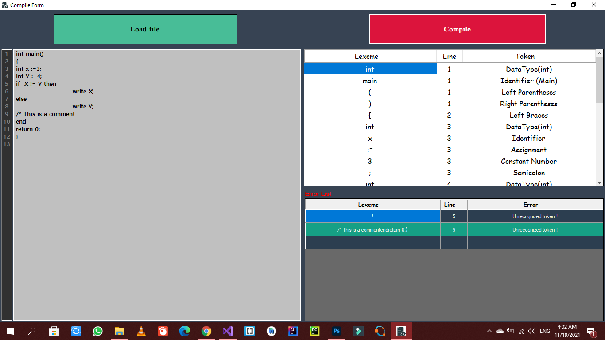

# Tiny Compiler
Implementing a Compiler to a new programming language called "Tiny".
- Fully Functional Scanner (for the Lexical Analysis Phase).

### [Milestones](https://github.com/Abanoub-Asaad/Tiny-Compiler/tree/main/Milestones)

### Runtime Screenshots

